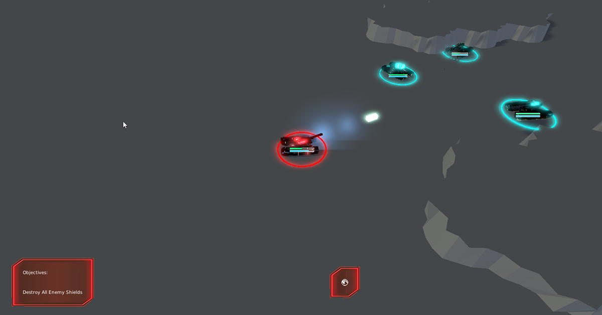
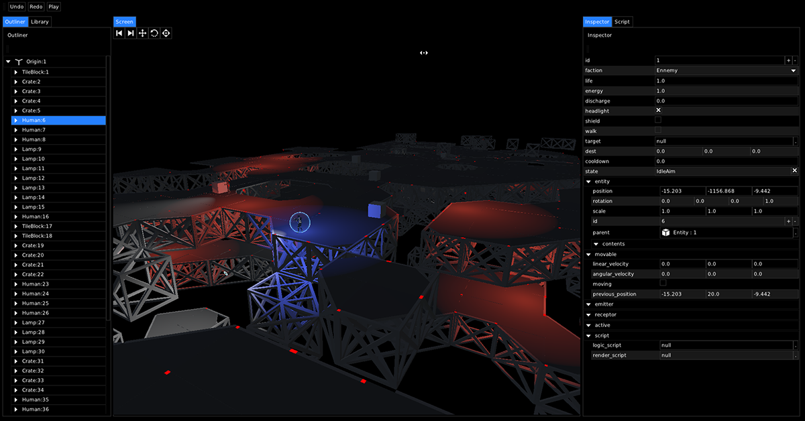
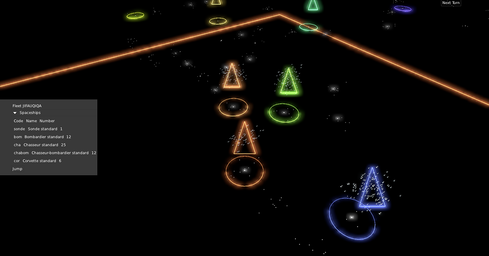

<p align="center"></p>

| CI            | Community     | Support   |
| ------------- | ------------- | --------- |
[](https://travis-ci.org/hugoam/toy) [](https://ci.appveyor.com/project/hugoam/toy) | [](https://discourse.toyengine.io) [](https://gitter.im/hugoam/mud) | [](https://www.patreon.com/bePatron?u=11301355)

toy is a **thin and modular c++ game engine**. it aims to provide the **thinnest and simplest stack of technology** for making games **directly from c++**. toy offers **simple expressive c++ idioms** for [user interface](), [rendering](), [audio](),  and the seamless extension of your game code with **zero-cost** [tools](), [editors]() and [scripting](), to design full featured 2d or 3d games in **fast iterations**.

toy simplicity and modularity makes it deeply **hackable**, **extensible** and **versatile**. toy is perfect to build games with **atypical constraint**: complex user interface and rendering schemes, procedural generation, etc. it provides a **fully programmable 3d renderer**, with full control over *shaders, materials and render paths*, as well as higher level primitives and systems such as **entities**, **physics**, **navmesh generation and navigation**, and **procedural generation** helpers.

As a collection of game programming **building blocks**, toy aims to foster an ecosystem of **simple minimal reusable components** suited for **building your own game technology**.

### principles
- **simple and lightweight**, simplicity is the core aim and philosophy behind toy. the codebase is about one-tenth the size of competing engines, and toy is so light, the whole editor runs in your browser !
- **modular**, each functionality is enclosed in a small, simple, easy to understand code building block. most of these blocks lie in the underlying mud library.
- **extensible**, as a collection of modules, toy is a perfect fit to build your own game technology, keeping full control over the components you use, the application design and the control flow.
- **game code first**, toy is first and foremost meant to build games in native c++ code, in direct contact with the core systems. this allows for much greater control than typical scripting in-engine.
- **versatile**, toy is designed from the start with complex games in mind, such as strategy or role playing games, by giving full control over its powerful user interface and rendering systems.
- **zero-cost tools**, reflection automatically extends your game core code for seamless scripting, editing, inspection of your game objects, types and procedures in the built-in tools/editor.
- **educative**, toy aims to provide simplest technical solutions to typical game programming problems, to be easily studied and understood, hoping to be a driver of education on game development topics.
- **fast iteration**, coupling seamless bindings of both built-in systems and game code to various scripting languages, hot-reload of native code, and immediate UI and rendering, toy provides fast iteration speeds.

### features
- **mud** is the low-level library providing most of the base features behind **toy**, in separate modules
  - reflection
  - **scripting**: Reflection automatically extends your game core code for seamless scripting via text-based languages (lua, Wren), and a node visual-scripting language, including interfaces for editing these. toy scripting component is so lean, it can be added to the game itself, for live scripting or for an in-game console.
  - rendering
  - **user interface**: A simple expressive user interface API is the fundamental block for writing any robust game or application. toy offers the best-in-class : immediate-mode widget declarations, fully automatic layout, css-like skinning, image-based skinning, style sheets, various input widgets, docking windows and tabs.
- entity
- physics
- navigation

### roadmap
toy is mostly feature complete in terms of the basic features we wanted for a minimal viable engine.
but there are many things to improve.
by supporting mud you will help us implement the following features:
- **tool applications**: implement minimal tooling apps, including: a model painter, an animation editor, a particle editor, a prefab/scene editor. most of these features are partly implemented, but a set of standalone apps would be a great addition.
- **scripting languages**: implement support for Wren, Javascript, and C# scripting.
- **clustered rendering**: implement state-of-the-art clustered rendering techniques, along with a deferred rendering pipeline.
- **real-time global illumnation**: investigate state-of-the-art global illumination techniques and implement the best real-time compromise currently feasible.
- **node-based shader language**: the mud node editor is a perfect tool to start playing with node-based shader and render pipeline definitions.
- **multi-threading**: implement efficient job/fibers system and parallelize everything that can be.
- **performance-focused ECS**: implement an ECS skeleton focused towards heavily parallelized performance, to implement typical scenarios such as the boid example.
- **networking**: investigate how a networking solution can be integrated with reflection, how to automatically expose objects procedures and fields through a networking API, to provide seamless basic multiplayer support, then implement it.

### manuals
If you want to get started, you can start by having a look at the extensive [manual]().

### examples

| Platform Example        | RTS Example             |
| ----------------------- | ----------------------- |
| [](https://hugoam.github.io/toy-io/examples/ex_platform.html) | [](https://hugoam.github.io/toy-io/examples/ex_blocks.html)      |

| Editor Example        | Space Example         |
| --------------------- | --------------------- |
| [](https://hugoam.github.io/toy-io/examples/ex_editor.html) | [](https://hugoam.github.io/toy-io/examples/ex_space.html)  |

### how to build

on linux :

```bash
git clone https://github.com/hugoam/toy --recursive
cd toy
bin/genie --gcc=linux-gcc gmake
cd build/projects/gmake-linux
make config=debug64 -j8
```
